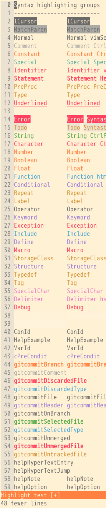
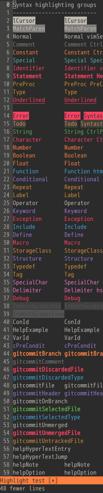

# carbonized

**carbonized** is a vim/terminal theme inspired by the [Carbon keycap set](https://geekhack.org/index.php?topic=79693.0) by T0mb3ry.

## screenshots

<table>
<tr></tr><tr><td align="center"><h5>carbonized-light</h5></td>
<td align="center"> </td>
<td align="center"><h5>carbonized-dark</h5></td></tr>
</table>

## installation

### step 1: download the colour scheme

#### option A: manually

Download the desired [colourscheme files](https://github.com/nightsense/carbonized/tree/master/colors) and place in directory `~/.vim/colors/` (Linux/Mac) or `%userprofile%\vimfiles\colors\` (Windows).

#### option B: using a plugin manager

For easy management of Vim colour schemes (and other plugins), try a plugin manager. With [vim-plug](https://github.com/junegunn/vim-plug), for instance, just add `Plug 'nightsense/carbonized'` to the list of plugins in `vimrc`, then run `PlugUpdate`.

### step 2: activate the colour scheme

To activate the carbonized theme, add one of the following lines to your `vimrc`:
- `colorscheme carbonized-light`
- `colorscheme carbonized-dark`
